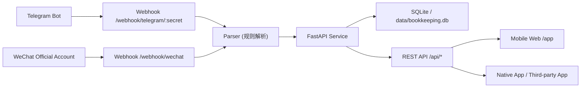

# Auto Ledger

通过公众号或 Telegram Bot 发一条消息，自动解析为收支记录，并同步到移动端页面/API。

## 项目亮点

- 输入自然语言即可记账，如 `午饭 23`、`收入 5000 工资`
- 支持 Telegram Webhook 自动入账
- 支持公众号服务器回调自动入账（文本消息）
- 提供 REST API，可对接任意手机 App/小程序
- 内置手机友好网页：`/app/`
- 单人自用默认无鉴权，部署更简单

## 架构



## 功能清单

- 自动识别金额、收支方向、分类、时间
- 去重入账（按 `external_id`）
- 流水查询与分页
- 时间区间过滤
- 收支汇总（近 N 天）
- Telegram/公众号回执提示（解析成功或失败）

## 技术栈

- FastAPI
- SQLAlchemy
- SQLite（默认，可切换到 MySQL/PostgreSQL）
- Docker + Docker Compose
- Caddy（生产环境自动 HTTPS）

## 快速开始

### 方式零：服务器一键运行（推荐）

```bash
git clone <your-repo-url> auto-ledger
cd auto-ledger
chmod +x scripts/one_click_run.sh
./scripts/one_click_run.sh
```

脚本会自动：

- 检查并安装 Docker（若未安装）
- 创建 `.env`（若不存在）
- 自动生成 `TELEGRAM_WEBHOOK_SECRET`、`WECHAT_TOKEN`
- 自动选择启动模式：
  - 配置了真实 `DOMAIN`：`app + caddy`（HTTPS webhook 模式）
  - 未配置 `DOMAIN`：快速模式（HTTP，且可选 Telegram polling）

### 方式一：本地 Docker 启动

```bash
cp .env.example .env
docker compose up -d --build
```

打开：

- API 文档：`http://127.0.0.1:8000/docs`
- 手机页面：`http://127.0.0.1:8000/app/`

### 方式二：Python 直接启动

```bash
python -m venv .venv
# Windows: .\.venv\Scripts\activate
# macOS/Linux: source .venv/bin/activate
pip install -r requirements.txt
cp .env.example .env
uvicorn app.main:app --host 0.0.0.0 --port 8000 --reload
```

## 生产部署（推荐）

项目已内置生产编排文件：

- `docker-compose.server.yml`（`app + caddy`）
- `Caddyfile`（自动申请 HTTPS 证书）
- `scripts/deploy_server.sh`（一键启动）

部署步骤：

```bash
git clone <your-repo-url> auto-ledger
cd auto-ledger
cp .env.example .env
```

编辑 `.env`（最少这些）：

```dotenv
DOMAIN=ledger.example.com
ACME_EMAIL=you@example.com
TELEGRAM_BOT_TOKEN=
TELEGRAM_WEBHOOK_SECRET=
WECHAT_TOKEN=
```

启动：

```bash
chmod +x scripts/deploy_server.sh
./scripts/deploy_server.sh
```

验证：

```bash
curl https://<YOUR_DOMAIN>/health
```

## Docker 镜像

本项目可直接构建镜像：

```bash
docker build -t auto-ledger:latest .
docker run -d --name auto-ledger -p 8000:8000 --env-file .env -v $(pwd)/data:/app/data auto-ledger:latest
```

## Webhook 接入

### Telegram

1. 在 `@BotFather` 创建机器人，获取 `TELEGRAM_BOT_TOKEN`
2. 设置 webhook：

```bash
curl "https://api.telegram.org/bot<TELEGRAM_BOT_TOKEN>/setWebhook?url=https://<YOUR_DOMAIN>/webhook/telegram/<TELEGRAM_WEBHOOK_SECRET>"
```

3. 查看 webhook 状态：

```bash
curl "https://api.telegram.org/bot<TELEGRAM_BOT_TOKEN>/getWebhookInfo"
```

### 公众号

1. 公众号后台 -> 开发管理 -> 基本配置
2. URL 填：`https://<YOUR_DOMAIN>/webhook/wechat`
3. Token 填：`WECHAT_TOKEN`
4. 联调阶段建议先使用“明文模式”

## API 概览

主要接口：

- `POST /api/parse`：文本解析并入账
- `POST /api/records`：手动创建账单
- `GET /api/records`：查询流水（支持分页、时间过滤）
- `GET /api/summary?days=30`：近 N 天收支汇总
- `GET /health`：健康检查

接口详情可见 `/docs`（OpenAPI）。

## 环境变量

| 变量名 | 默认值 | 说明 |
| --- | --- | --- |
| `APP_NAME` | `Auto Ledger` | 应用名称 |
| `TZ` | `Asia/Shanghai` | 解析时间时区 |
| `DATABASE_URL` | `sqlite:///./data/bookkeeping.db` | 数据库连接串 |
| `DOMAIN` | `ledger.example.com` | Caddy 域名 |
| `ACME_EMAIL` | `you@example.com` | HTTPS 证书邮箱 |
| `TELEGRAM_BOT_TOKEN` | 空 | Telegram Bot Token |
| `TELEGRAM_WEBHOOK_SECRET` | 空 | Telegram Webhook 路径密钥 |
| `WECHAT_TOKEN` | 空 | 公众号签名 Token |

## 示例输入

- `午饭 23`
- `昨天打车 18.5`
- `收入 1200 兼职`
- `+88 红包`
- `2026-03-20 咖啡 19`

## Telegram 命令

- `/help` 查看帮助
- `/list` 查看最近 10 条账单
- `/list 20` 查看最近 20 条账单（最大 50）
- `/summary` 查看最近 30 天汇总
- `/summary 7` 查看最近 7 天汇总
- `/month` 查看本月汇总
- `/category` 查看本月支出分类统计
- `/category income` 查看本月收入分类统计
- `/category expense 30` 查看最近 30 天支出分类统计

## 项目结构

```text
app/
  main.py                # FastAPI 入口
  parser.py              # 文本解析逻辑
  models.py              # 数据模型
  routers/
    records.py           # API 接口
    telegram.py          # Telegram Webhook
    wechat.py            # 公众号 Webhook
  static/
    index.html           # 移动端页面
    app.js
    styles.css
scripts/
  deploy_server.sh       # 服务器一键启动
  one_click_run.sh       # 安装+部署一体化脚本
```

## Roadmap

- 支持语义更强的 LLM 解析器（可插拔）
- 支持预算预警（分类预算/月预算）
- 支持导出（CSV/Excel）
- 支持多账本与多用户
- 支持记账通知推送（日报/周报）

## 贡献

欢迎 PR 和 Issue。

1. Fork 本仓库
2. 新建分支：`git checkout -b feat/your-feature`
3. 提交修改：`git commit -m "feat: xxx"`
4. 推送分支并发起 PR

## License

本项目采用 MIT License，详见 [LICENSE](./LICENSE)。
